# Электоральная форензика: Самарская область, выборы в Государственную Думу IX созыва (20 сентября 2026)

**Поучастковый анализ результатов по одномандатным округам №159–163.**

Данные: протоколы УИК из ГАС «Выборы», выгрузка от 22.09.2026. Обработано **1703** участковые комиссии (22 сводки ТИК отфильтрованы); суммы сходятся с официальными итогами. Первоисточник: портал ЦИК, сырые JSON-протоколы сохранены в каталоге `raw/`.

> ⚠️ Статистические аномалии — признаки, дающие основания для сомнений и официальных запросов, но не юридические доказательства. Данные предварительные.

## Содержание
1. [Методика](#методика)
2. [Сводная таблица по округам](#сводка)
3. [Округ №162 Жигулевский](#okr162)
4. [Округ №161 Красноглинский](#okr161)
5. [Округ №163 Промышленный](#okr163)
6. [Округ №159 Самарский](#okr159)
7. [Округ №160 Тольяттинский](#okr160)
8. [Аномалии у кандидатов оппозиции](#оппозиция)
9. [Интерпретация](#интерпретация)
10. [Приложения](#приложения)

## Методика

| Тест | Что ищет | Ожидание при честном голосовании |
|---|---|---|
| Явка 100% / ≥99,5% | «Закрытие списка» | Единичные случаи на карликовых УИК |
| Точная целая явка (70%, 81%, …) | Подгонка чисел | ~1% УИК случайно |
| «Вылизанная» явка (70/75/80/85/90/95 ±0,05) | Маскированная подгонка | Редкие совпадения |
| «Полки» результата (80/85/90/95 ±0,05) | Квоты на участок | — |
| 100% за кандидата / недействительных 0 | Замена результатов | Почти невозможно на УИК >50 изб. |
| «Ровно 1 голос» оппозиции при явке >100 чел. | Символические дозаписи | Только на карликовых УИК |
| Дубли абсолютных чисел между УИК | Копипаст «порций» голосов | Единичные |
| Выброс внутри ТИК (≥90% при медиане ТИК <60%) | Локальный вброс | — |
| Корреляция «% × явка» | Зависимость результата от явки | r ≈ 0 у всех кандидатов |

Аномальным считается УИК, где сработал хотя бы один тест; зоной концентрации — ТИК со множеством срабатываний. Полный реестр: `suspicious_uiks.csv`.

## Сводная таблица по округам

| Округ | Лидер (партия) | Официально | r(%×явка) | Без аномальных УИК* | Аномальных УИК |
|---|---|---|---|---|---|
| №162 Жигулевский | Трифонов (ЕР) | 65,7% | +0,88 | 50,7% (−231 УИК) | 130 из 402 (32,3%) |
| №161 Красноглинский | Портнягин (ЕР) | 68,9% | +0,77 | 51,4% (−259 УИК) | 159 из 448 (35,5%) |
| №163 Промышленный | Живайкин (ЕР) | 39,9% | +0,78 | 36,4% (−33 УИК) | 81 из 325 (24,9%) |
| №159 Самарский | Фетисов (ЕР) | 55,5% | +0,77 | 46,1% (−83 УИК) | 51 из 323 (15,8%) |
| №160 Тольяттинский | Калашников (КПРФ) | 38,5% | +0,86 | 27,9% (−23 УИК) | 50 из 205 (24,4%) |

\* Контрфактический тест: исключены УИК с явкой >60% и результатом лидера >70% (в городских ТИК таких почти нет). Это оценка масштаба «сельской надбавки», а не точный прогноз.

---

## Округ №162 — Жигулевский

**Лидер:** Трифонов Андрей Федорович (ЕР), официально **65,7%**. Явка по округу: 67,8%. Аномальных УИК: **130 из 402**.

Корреляция «% за Трифонов (ЕР) × явка»: **r = +0,88** (честное голосование: r ≈ 0; у остальных кандидатов r отрицательный, до −0,8). Контрфактически без аномальных «верхних» УИК: 65,7% → **50,7%**.

**Явка 100% / ≥99,5% — 7 УИК:**

| УИК | ТИК | Избирателей | Явка, % | % за лидера |
|---|---|---|---|---|
| 3781 | Сызранская городская | 396 | 100,00 | 97,7 |
| 2204 | Пестравская | 259 | 100,00 | 91,5 |
| 3760 | Сызранская городская | 246 | 100,00 | 86,2 |
| 3625 | Сызранская | 245 | 99,59 | 77,0 |
| 1605 | Красноармейская | 153 | 100,00 | 80,4 |
| 3761 | Сызранская городская | 32 | 100,00 | 100,0 |
| 3784 | Сызранская городская | 1 | 100,00 | 100,0 |

**Точная целая явка (<100%):** 2409, 4215.

**«Ровно 1 голос» у оппозиции при явке ≥100 человек — 21 УИК:** УИК 220 (Безенчукская, явившихся 146); УИК 229 (Безенчукская, явившихся 143); УИК 1612 (Красноармейская, явившихся 130); УИК 2206 (Пестравская, явившихся 298); УИК 2401 (Приволжская, явившихся 106); УИК 2405 (Приволжская, явившихся 136); УИК 2406 (Приволжская, явившихся 112); УИК 2407 (Приволжская, явившихся 115); УИК 2409 (Приволжская, явившихся 329); УИК 2412 (Приволжская, явившихся 398); УИК 2422 (Приволжская, явившихся 457); УИК 2425 (Приволжская, явившихся 116); УИК 2427 (Приволжская, явившихся 451); УИК 3605 (Сызранская, явившихся 210); УИК 3760 (Сызранская городская, явившихся 246)….

**Дубли числа голосов** у Трифонов (ЕР): 215 голосов на УИК [3907, 3909, 3927]; 232 голосов на УИК [3621, 3932, 4518]; 256 голосов на УИК [3501, 3608, 3912, 3919]; 270 голосов на УИК [2206, 3908, 4109].

**100% голосов у лидера (недействительных 0):** 2426, 3761, 3784.

**Концентрация аномалий по ТИК:** Приволжская (29), Пестравская (23), Хворостянская (21), Тольятти, Комсомольская (10), Сызранская городская (9), Безенчукская (8).

**Интерпретация:** Максимальная корреляция %×явка в области (r=+0,88) и 76 УИК с явкой ≥95% и результатом ≥90%. Пара 3761/3784 (Сызранская городская) — полностью идентичные протоколы (100% явка, 100% Трифонов (ЕР), ноль недействительных); УИК 3784 числит 1 избирателя. Контрфактически 65,7% → 50,7%.

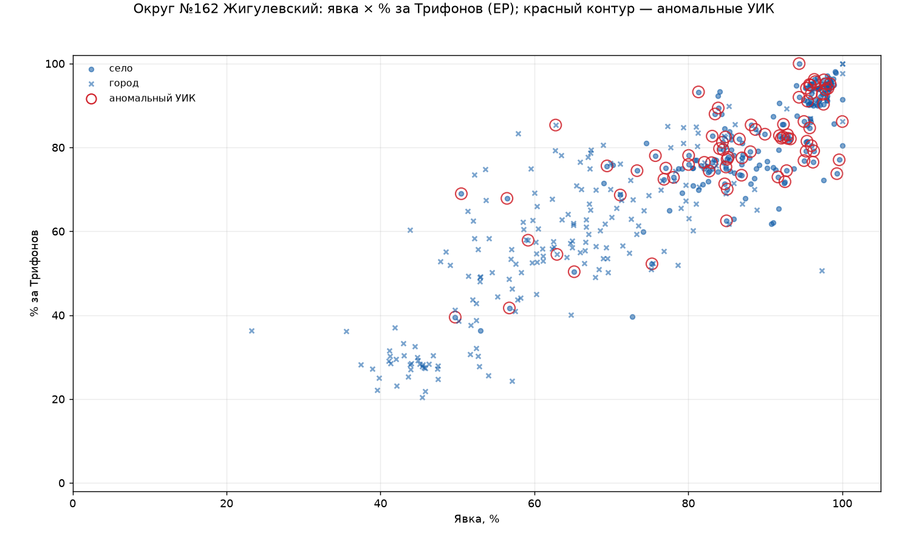

*Явка × % за Трифонов (ЕР). Красным контуром выделены УИК из реестра подозрительных — виден «хвост» аномальных участков в правом верхнем углу (высокая явка + высокий результат), городской сектор (крестики) контуром практически не затронут.*

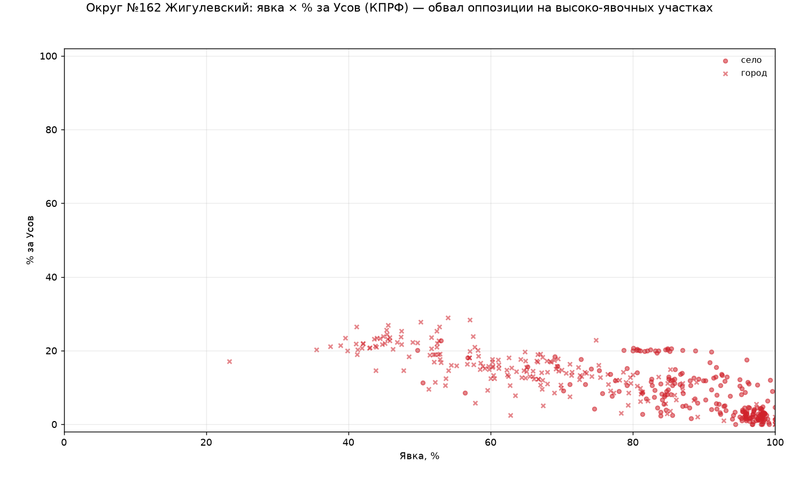

*Тот же график для основного оппозиционера Усов (КПРФ): его доля не растёт с явкой, а на высоко-явочных сельских участках падает почти до нуля — зеркальное отражение «надбавки» лидера.*

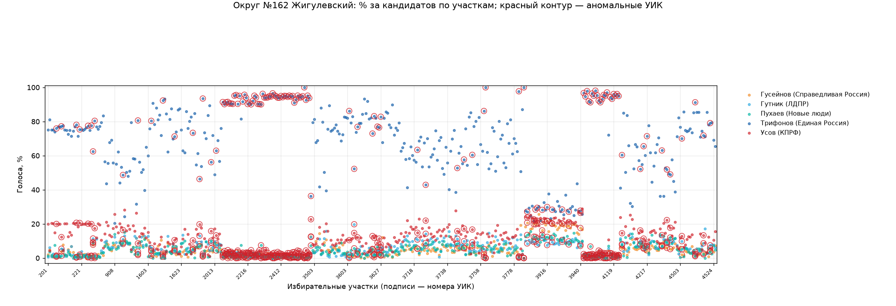

*Проценты всех кандидатов по участкам; красный контур — аномальные УИК. У лидера контуры собираются в «полки», у остальных кандидатов на тех же участках — провал к нулю.*

---

## Округ №161 — Красноглинский

**Лидер:** Портнягин Денис Олегович (ЕР), официально **68,9%**. Явка по округу: 61,3%. Аномальных УИК: **159 из 448**.

Корреляция «% за Портнягин (ЕР) × явка»: **r = +0,77** (честное голосование: r ≈ 0; у остальных кандидатов r отрицательный, до −0,8). Контрфактически без аномальных «верхних» УИК: 68,9% → **51,4%**.

**Явка 100% / ≥99,5% — 11 УИК:**

| УИК | ТИК | Избирателей | Явка, % | % за лидера |
|---|---|---|---|---|
| 1526 | Кошкинская | 447 | 99,55 | 96,6 |
| 1523 | Кошкинская | 295 | 100,00 | 85,1 |
| 808 | Елховская | 250 | 100,00 | 90,4 |
| 2714 | Самара, Красноглинская | 243 | 100,00 | 71,6 |
| 807 | Елховская | 235 | 100,00 | 93,2 |
| 1522 | Кошкинская | 230 | 99,57 | 88,2 |
| 1528 | Кошкинская | 188 | 100,00 | 47,3 |
| 1529 | Кошкинская | 140 | 100,00 | 50,0 |
| 2692 | Самара, Кировская | 137 | 100,00 | 34,3 |
| 1114 | Камышлинская | 98 | 100,00 | 70,4 |
| 2690 | Самара, Кировская | 55 | 100,00 | 20,0 |

**Точная целая явка (<100%):** 1703, 1742, 3424.

**«Ровно 1 голос» у оппозиции при явке ≥100 человек — 37 УИК:** УИК 801 (Елховская, явившихся 197); УИК 803 (Елховская, явившихся 468); УИК 807 (Елховская, явившихся 235); УИК 818 (Елховская, явившихся 151); УИК 1013 (Исаклинская, явившихся 130); УИК 1102 (Камышлинская, явившихся 161); УИК 1410 (Клявлинская, явившихся 172); УИК 1418 (Клявлинская, явившихся 203); УИК 1419 (Клявлинская, явившихся 131); УИК 1422 (Клявлинская, явившихся 117); УИК 1423 (Клявлинская, явившихся 112); УИК 1511 (Кошкинская, явившихся 320); УИК 1514 (Кошкинская, явившихся 142); УИК 1515 (Кошкинская, явившихся 191); УИК 1519 (Кошкинская, явившихся 202)….

**Дубли числа голосов** у Портнягин (ЕР): 112 голосов на УИК [1521, 1532, 2606, 2654]; 125 голосов на УИК [1409, 1514, 2659]; 131 голосов на УИК [1008, 4401, 4417]; 146 голосов на УИК [1534, 1745, 2619, 4702].

**Концентрация аномалий по ТИК:** Челно-Вершинская (26), Кошкинская (22), Похвистневская (20), Самара, Кировская (16), Шенталинская (15), Елховская (13).

**Интерпретация:** Самая выраженная «квотовая» структура: 33 УИК с результатом лидера ровно в бине 90%, 9 УИК со стопроцентной явкой (включая два городских — 2690, 2692 в Самаре), массовые «1 голос» оппозиции. Контрфактически Портнягин (ЕР) 68,9% → 51,4% — мандат сохраняется, но с минимальным запасом.

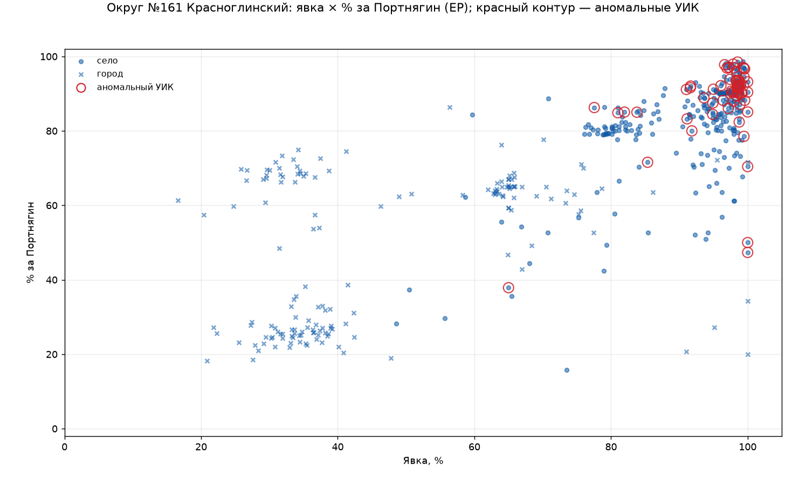

*Явка × % за Портнягин (ЕР). Красным контуром выделены УИК из реестра подозрительных — виден «хвост» аномальных участков в правом верхнем углу (высокая явка + высокий результат), городской сектор (крестики) контуром практически не затронут.*

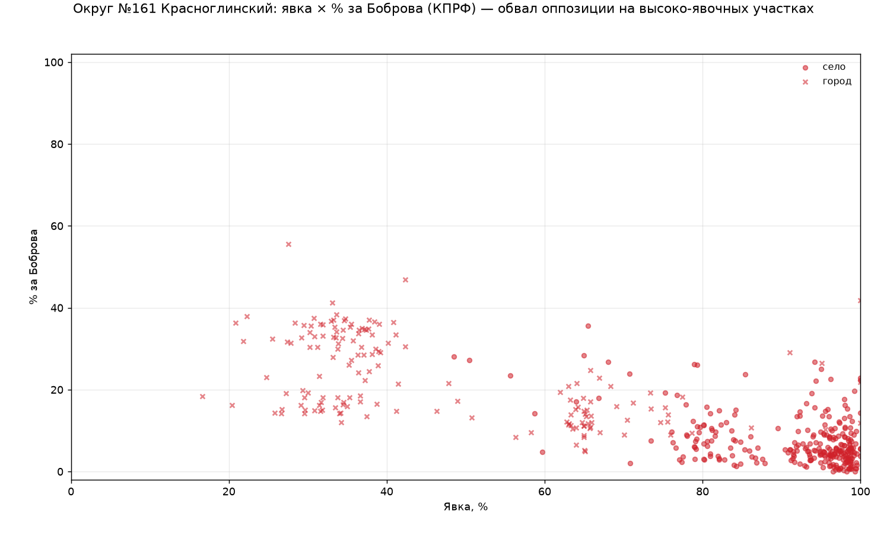

*Тот же график для основного оппозиционера Боброва (КПРФ): его доля не растёт с явкой, а на высоко-явочных сельских участках падает почти до нуля — зеркальное отражение «надбавки» лидера.*

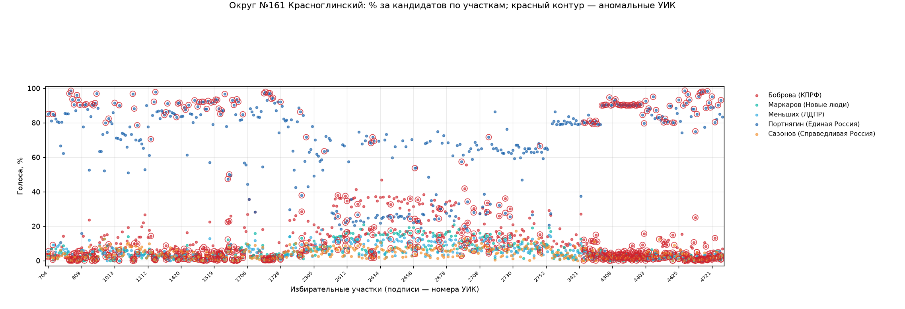

*Проценты всех кандидатов по участкам; красный контур — аномальные УИК. У лидера контуры собираются в «полки», у остальных кандидатов на тех же участках — провал к нулю.*

---

## Округ №163 — Промышленный

**Лидер:** Живайкин Александр Иванович (ЕР), официально **39,9%**. Явка по округу: 45,3%. Аномальных УИК: **81 из 325**.

Корреляция «% за Живайкин (ЕР) × явка»: **r = +0,78** (честное голосование: r ≈ 0; у остальных кандидатов r отрицательный, до −0,8). Контрфактически без аномальных «верхних» УИК: 39,9% → **36,4%**.

**Явка 100% / ≥99,5% — 5 УИК:**

| УИК | ТИК | Избирателей | Явка, % | % за лидера |
|---|---|---|---|---|
| 619 | Борская | 1335 | 99,78 | 65,1 |
| 605 | Борская | 1294 | 100,00 | 59,6 |
| 627 | Борская | 574 | 99,65 | 78,1 |
| 3365 | Самара, Советская | 31 | 100,00 | 93,5 |
| 3364 | Самара, Советская | 14 | 100,00 | 92,9 |

**Точная целая явка (<100%):** 3338.

**«Ровно 1 голос» у оппозиции при явке ≥100 человек — 7 УИК:** УИК 601 (Борская, явившихся 247); УИК 608 (Борская, явившихся 586); УИК 611 (Борская, явившихся 279); УИК 617 (Борская, явившихся 801); УИК 630 (Борская, явившихся 359); УИК 632 (Борская, явившихся 268); УИК 4623 (Кинельская, явившихся 318).

**Выбросы внутри ТИК** (лидер ≥90% при медиане ТИК <60%): УИК 3365 (Самара, Советская: медиана 30,3%, результат 93,5%); УИК 3364 (Самара, Советская: медиана 30,3%, результат 92,9%).

**Дубли числа голосов** у Живайкин (ЕР): 116 голосов на УИК [1207, 3330, 5026]; 139 голосов на УИК [1310, 1330, 3357]; 153 голосов на УИК [723, 5024, 5045]; 158 голосов на УИК [1216, 5047, 5054].

**Концентрация аномалий по ТИК:** Самара, Промышленная (30), Самара, Советская (17), Борская (11), Кинельская городская (10), Кинельская (6), Кинель-Черкасская (4).

**Интерпретация:** Наиболее конкурентный и наименее аномальный округ (лидер официально 39,9%). Основные следы — дубликаты УИК 3364/3365 (Самара, Советская; 14 и 31 избиратель, 100% явка, ~93% за Живайкина) и УИК 605 (Борская, 1294 избирателя, точная явка 100%). Контрфактическая разница невелика (39,9% → 36,4%), но сопоставима с разрывом с Матвеевым — при честном подсчёте исход был бы неочевиден.

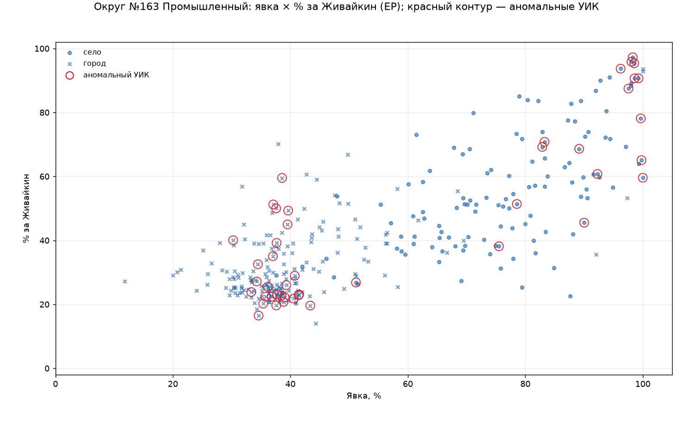

*Явка × % за Живайкин (ЕР). Красным контуром выделены УИК из реестра подозрительных — виден «хвост» аномальных участков в правом верхнем углу (высокая явка + высокий результат), городской сектор (крестики) контуром практически не затронут.*

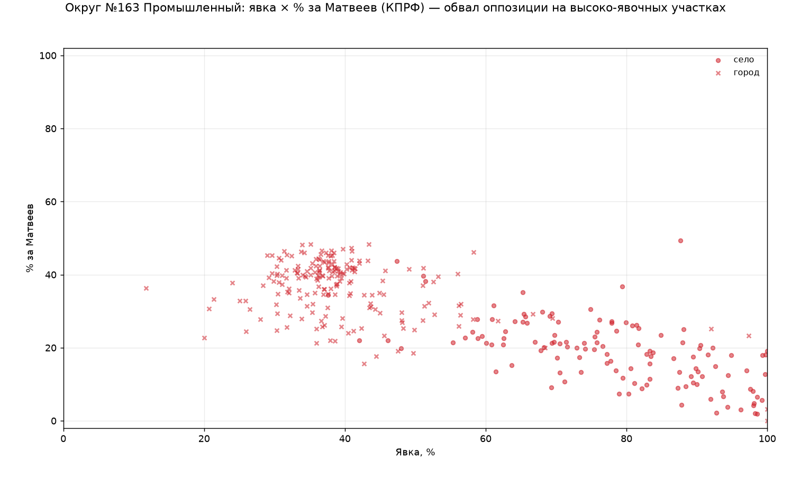

*Тот же график для основного оппозиционера Матвеев (КПРФ): его доля не растёт с явкой, а на высоко-явочных сельских участках падает почти до нуля — зеркальное отражение «надбавки» лидера.*

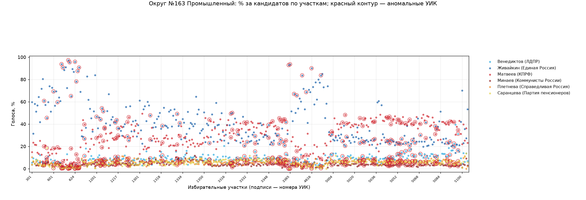

*Проценты всех кандидатов по участкам; красный контур — аномальные УИК. У лидера контуры собираются в «полки», у остальных кандидатов на тех же участках — провал к нулю.*

---

## Округ №159 — Самарский

**Лидер:** Фетисов Александр Борисович (ЕР), официально **55,5%**. Явка по округу: 53,8%. Аномальных УИК: **51 из 323**.

Корреляция «% за Фетисов (ЕР) × явка»: **r = +0,77** (честное голосование: r ≈ 0; у остальных кандидатов r отрицательный, до −0,8). Контрфактически без аномальных «верхних» УИК: 55,5% → **46,1%**.

**Явка 100% / ≥99,5% — 3 УИК:**

| УИК | ТИК | Избирателей | Явка, % | % за лидера |
|---|---|---|---|---|
| 1821 | Нефтегорская | 759 | 100,00 | 68,9 |
| 2837 | Самара, Куйбышевская | 357 | 100,00 | 50,1 |
| 3054 | Самара, Октябрьская | 129 | 100,00 | 66,7 |

**Точная целая явка (<100%):** 510.

**«Ровно 1 голос» у оппозиции при явке ≥100 человек — 9 УИК:** УИК 410 (Большеглушицкая, явившихся 115); УИК 505 (Большечерниговская, явившихся 500); УИК 510 (Большечерниговская, явившихся 608); УИК 515 (Большечерниговская, явившихся 219); УИК 518 (Большечерниговская, явившихся 245); УИК 522 (Большечерниговская, явившихся 306); УИК 711 (Волжская-159, явившихся 601); УИК 744 (Волжская-159, явившихся 306); УИК 1805 (Нефтегорская, явившихся 107).

**Дубли числа голосов** у Фетисов (ЕР): 168 голосов на УИК [126, 516, 2518]; 209 голосов на УИК [1944, 3003, 3206]; 218 голосов на УИК [2502, 2906, 3204]; 222 голосов на УИК [518, 1906, 1931].

**Концентрация аномалий по ТИК:** Большечерниговская (13), Большеглушицкая (7), Новокуйбышевская городская (6), Самара, Железнодорожная (5), Самара, Октябрьская (5), Волжская-159 (4).

**Интерпретация:** Аномалии сосредоточены в сельских ТИК (Большечерниговская, Нефтегорская, Волжская-159) и нескольких малых городских УИК. Контрфактический результат Фетисова (~46%) опускается в зону конкурентной неопределённости — при честном подсчёте исход мандата не предопределён. Это округ с наибольшей ставкой: без аномальных УИК победа лидера не выглядит гарантированной.

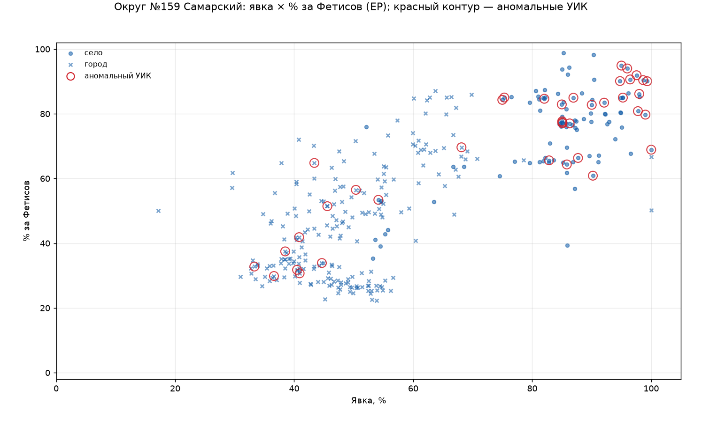

*Явка × % за Фетисов (ЕР). Красным контуром выделены УИК из реестра подозрительных — виден «хвост» аномальных участков в правом верхнем углу (высокая явка + высокий результат), городской сектор (крестики) контуром практически не затронут.*

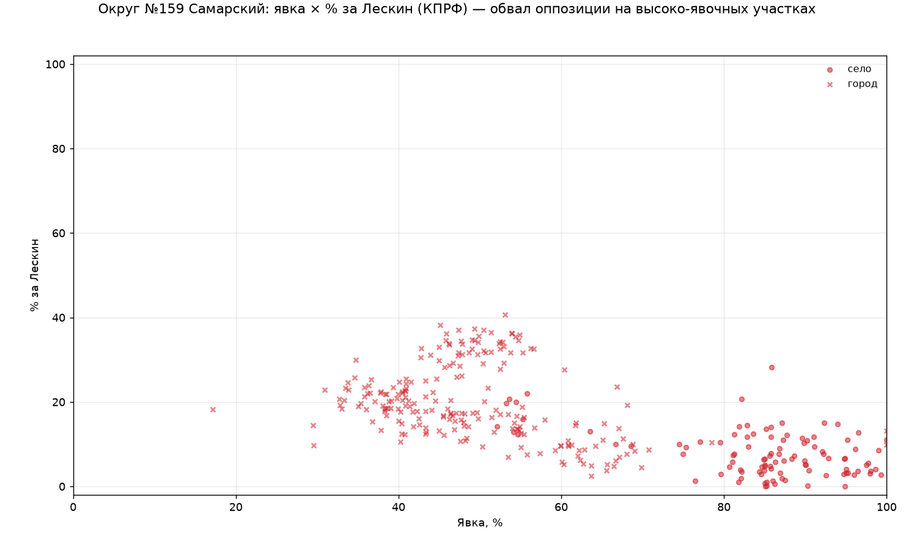

*Тот же график для основного оппозиционера Лескин (КПРФ): его доля не растёт с явкой, а на высоко-явочных сельских участках падает почти до нуля — зеркальное отражение «надбавки» лидера.*

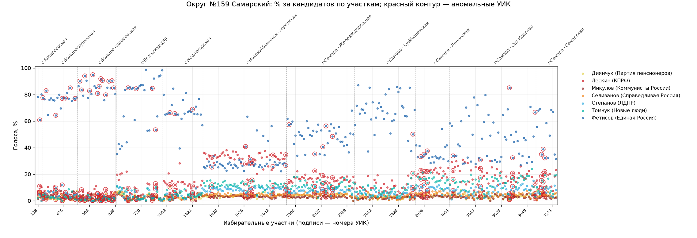

*Проценты всех кандидатов по участкам; красный контур — аномальные УИК. У лидера контуры собираются в «полки», у остальных кандидатов на тех же участках — провал к нулю.*

---

## Округ №160 — Тольяттинский

**Лидер:** Калашников Леонид Иванович (КПРФ), официально **38,5%**. Явка по округу: 43,7%. Аномальных УИК: **50 из 205**.

Корреляция «% за Калашников (КПРФ) × явка»: **r = +0,86** (честное голосование: r ≈ 0; у остальных кандидатов r отрицательный, до −0,8). Контрфактически без аномальных «верхних» УИК: 38,5% → **27,9%**.

**Точная целая явка (<100%):** 6044.

**«Ровно 1 голос» у оппозиции при явке ≥100 человек — 14 УИК:** УИК 3507 (Ставропольская-160, явившихся 1120); УИК 3508 (Ставропольская-160, явившихся 318); УИК 3514 (Ставропольская-160, явившихся 895); УИК 3517 (Ставропольская-160, явившихся 494); УИК 3518 (Ставропольская-160, явившихся 333); УИК 3519 (Ставропольская-160, явившихся 1104); УИК 3523 (Ставропольская-160, явившихся 1950); УИК 3525 (Ставропольская-160, явившихся 1887); УИК 3527 (Ставропольская-160, явившихся 1303); УИК 3528 (Ставропольская-160, явившихся 1259); УИК 3529 (Ставропольская-160, явившихся 1184); УИК 3536 (Ставропольская-160, явившихся 282); УИК 3543 (Ставропольская-160, явившихся 2170); УИК 3545 (Ставропольская-160, явившихся 2109).

**Дубли числа голосов** у Калашников (КПРФ): 196 голосов на УИК [4025, 4044, 6029, 6145]; 212 голосов на УИК [4024, 4030, 6024, 6030, 6032, 6110]; 222 голосов на УИК [4042, 6007, 6065]; 232 голосов на УИК [4055, 6005, 6036, 6061].

**Концентрация аномалий по ТИК:** Тольятти, Автозаводская (25), Ставропольская-160 (14), Тольятти, Центральная (11).

**Интерпретация:** Уникальный случай: аномальная машина работала на победителя от КПРФ. Серия УИК 3507–3546 (Ставропольская-160, сельский Ставропольский район) дала Калашникову 94–99% при явке 72–87%, при этом соседний УИК 3515 при той же явке — 13,3%. Город Тольятти голосовал конкурентно (медиана явки 40%). Мандат Калашникова держится на ~24 «сельских» участках.

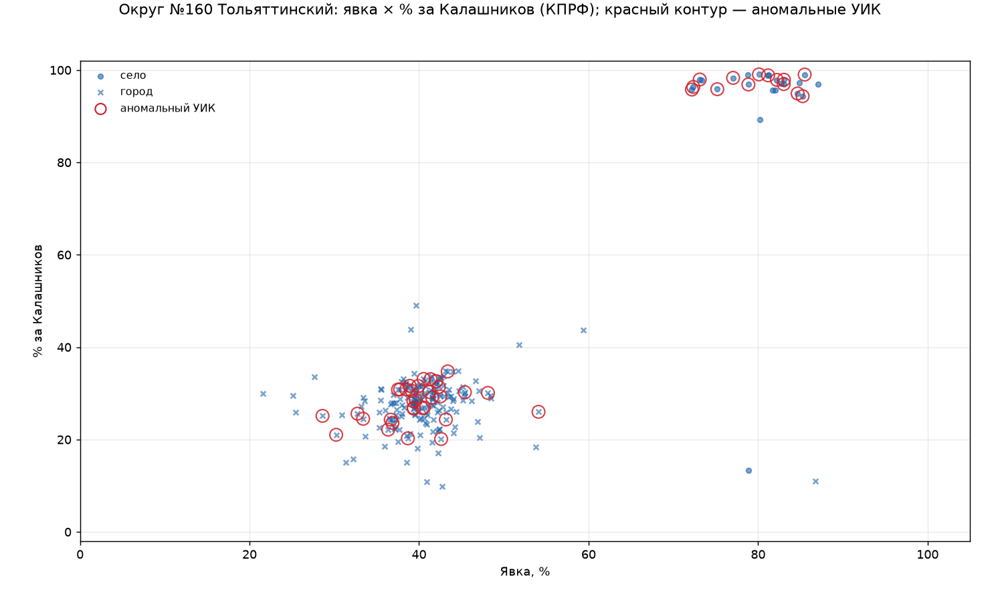

*Явка × % за Калашников (КПРФ). Красным контуром выделены УИК из реестра подозрительных — виден «хвост» аномальных участков в правом верхнем углу (высокая явка + высокий результат), городской сектор (крестики) контуром практически не затронут.*

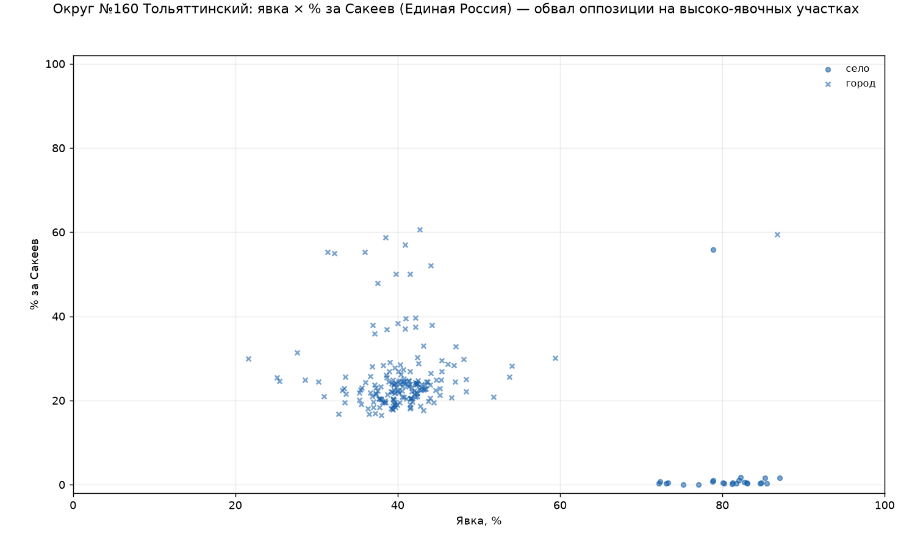

*Тот же график для основного оппозиционера Сакеев (ЕР): его доля не растёт с явкой, а на высоко-явочных сельских участках падает почти до нуля — зеркальное отражение «надбавки» лидера.*

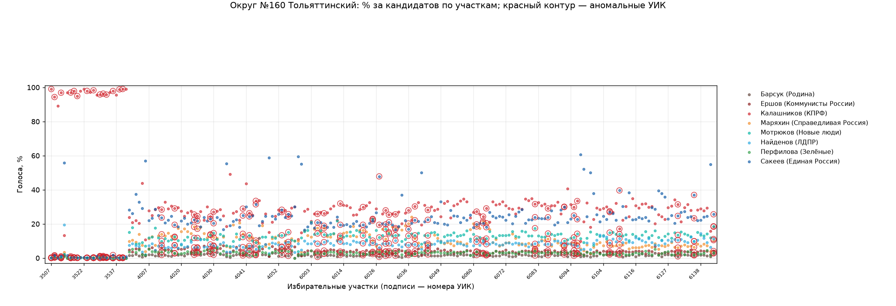

*Проценты всех кандидатов по участкам; красный контур — аномальные УИК. У лидера контуры собираются в «полки», у остальных кандидатов на тех же участках — провал к нулю.*

---

## Аномалии у кандидатов оппозиции

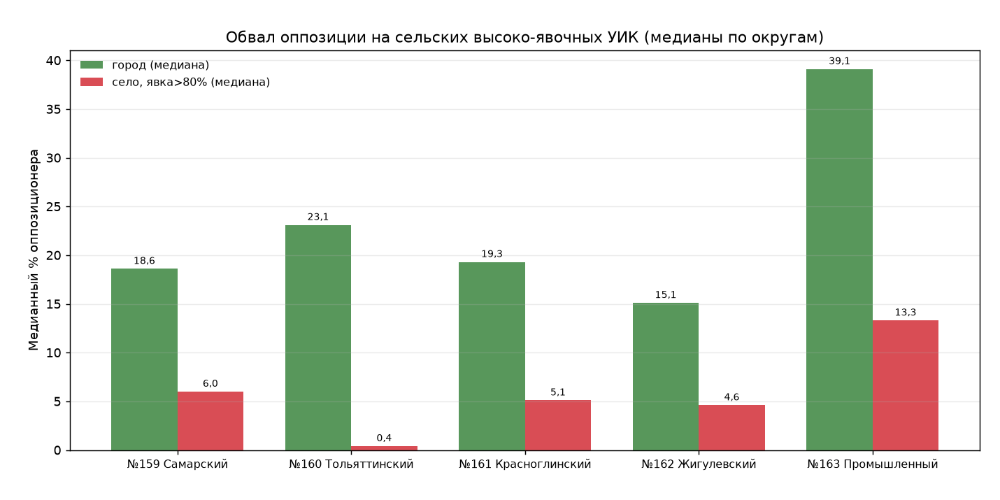

*Медианная доля основного оппозиционера: городские УИК против сельских с явкой >80%. Во всех пяти округах оппозиция на «аномальных» сельских участках теряет 3–58 крат.*

**1. Обвал оппозиции на высоко-явочных сельских УИК.** Медианная доля основного оппозиционера округа на городских УИК против сельских УИК с явкой >80%:

| Округ | Оппозиционер | Город (медиана) | Село при явке >80% (медиана) | Обвал |
|---|---|---|---|---|
| №162 Жигулевский | Усов (КПРФ) | 15,1% | 4,6% | ×3 |
| №161 Красноглинский | Боброва (КПРФ) | 19,3% | 5,1% | ×4 |
| №163 Промышленный | Матвеев (КПРФ) | 39,1% | 13,3% | ×3 |
| №159 Самарский | Лескин (КПРФ) | 18,6% | 6,0% | ×3 |
| №160 Тольяттинский | Сакеев (ЕР) | 23,1% | 0,4% | ×58 |

2. **Количественная оценка занижения.** Если доля оппозиционера на сельских УИК совпадала бы с его долей на городских УИК того же округа (экстраполяция на сельские УИК с явкой >60%):

| Округ | Оппозиционер | Ожидалось голосов | Фактически | Сохранено |
|---|---|---|---|---|
| №162 Жигулевский | Усов (КПРФ) | ~17488 | 9828 | 56% |
| №162 Жигулевский | Гутник (ЛДПР) | ~9086 | 3459 | 38% |
| №161 Красноглинский | Боброва (КПРФ) | ~33439 | 10663 | 32% |
| №161 Красноглинский | Маркаров (НЛ) | ~15945 | 5020 | 31% |
| №163 Промышленный | Матвеев (КПРФ) | ~21660 | 10141 | 47% |
| №163 Промышленный | Венедиктов (ЛДПР) | ~6156 | 3717 | 60% |
| №159 Самарский | Лескин (КПРФ) | ~12562 | 4177 | 33% |
| №159 Самарский | Томчук (НЛ) | ~7522 | 2087 | 28% |
| №160 Тольяттинский | Сакеев (ЕР) | ~8069 | 413 | 5% |
| №160 Тольяттинский | Мотрюков (НЛ) | ~4092 | 68 | 2% |

В сельской зоне кандидатам «недописали» от 44% (Усов (КПРФ)) до 98% (Мотрюков (Новые люди)) ожидаемых голосов — зеркальное отражение «сельской надбавки» лидеров.

3. **Символические значения.** На сельских УИК с явкой >80% значения голосов оппозиции систематически падают в диапазон 0–10: у Жигулёвского, Красноглинского и Промышленного округов такие значения составляют 28–51% всех «оппозиционных ячеек» (при честном голосовании и явке 500+ человек это невозможно — ожидаемые значения сотни). В Тольяттинском округе (серия Ставропольская-160) доля нулей у оппозиции — 13%, единиц — 24% (т.е. 37% ячеек с 0–1 голосом).

Всего **130 УИК**, где **как минимум два кандидата получили не более 2 голосов** при явке ≥100 человек: 162 Жигулевский — 34, 161 Красноглинский — 52, 163 Промышленный — 7, 159 Самарский — 16, 160 Тольяттинский — 21. Полная таблица — в [Приложениях](#таблица-нулей).

4. **«Квоты» оппозиции.** У кандидатов оппозиции тоже встречаются повторяющиеся одинаковые абсолютные значения на множестве УИК (например, у Бобровой ровно 15 голосов на 11 УИК и ровно 20 — на 8 УИК Красноглинского округа; у Усова ровно 20 — на 8 УИК Жигулёвского). Сами по себе совпадения на малых числах возможны случайно, поэтому рассматривать их следует только в совокупности с остальными признаками на тех же УИК.

---

## Общая интерпретация

1. **Двухсекторная структура.** По всем пяти округам распределения бимодальны: городские УИК Самары, Тольятти, Сызрани, Новокуйбышевска образуют нормальный колокол (явка 35–50%, конкурентные результаты, недействительные 5–8%), сельские ТИК — отдельную моду с явкой 90–100% и результатом победителя 80–99%. В группе «лидер >80%» медианные недействительные — 0,00–0,31% против 5,2–8,5% в группе «<50%».
2. **Голосование по квоте.** Пики ровно на 80/85/90/95% и 100%-е явки с нулевыми недействительными указывают на заранее заданные целевые показатели.
3. **Символические голоса.** 164 случая «ровно 1 голос» (при явившихся до 2100 человек) и 184 случая нуля — после фиксации квоты победителя остальным записали «по голосу». При реальной доле хотя бы 2–3% ожидание — десятки голосов, а не единица.
4. **Механические следы.** Дубликаты абсолютных чисел между УИК (по 3–6 комиссий с одинаковым числом голосов, в т.ч. между ТИК) и полностью идентичные протоколы 3761/3784 — признаки копирования «порций».
5. **Масштаб.** «Сельская надбавка» — от ~26% голосов лидера в Промышленном округе до ~28–30% в Самарском и Тольяттинском (Шпилькин-регрессия и контрфактический тест). В Тольяттинском округе та же технология работала на КПРФ — аномалии партийно неокрашены.
6. **Вердикт по мандатам.** Все победители получали большинство и без аномалий, кроме **№159 Самарский**: контрфактические ~46% Фетисова — зона неопределённости. В **№163 Промышленном** масштаб аномалий сопоставим с разрывом между Живайкиным и Матвеевым — исход при честном подсчёте неочевиден.

**Рекомендации:** запросить копии протоколов УИК из реестра (suspicious_uiks.csv) с подписями членов комиссий; сопоставить с видеонаблюдением и КОИБ; направить обращения в ИКСО №63 и прокуратуру с фокусом на ТИК-лидеров концентрации аномалий.

## Приложения

### Ключевые графики

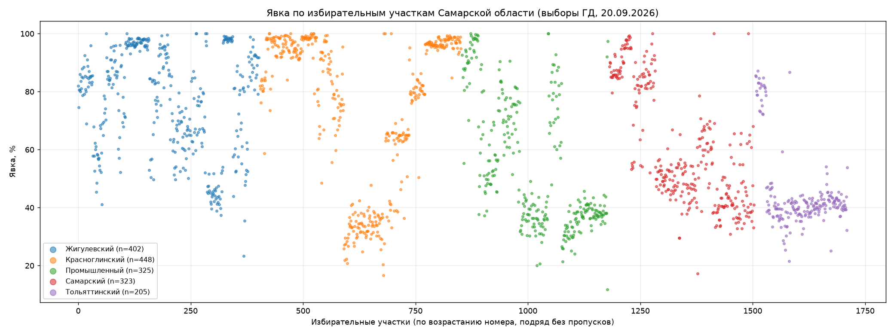

*Явка по всем участкам области (цвет — округ)*

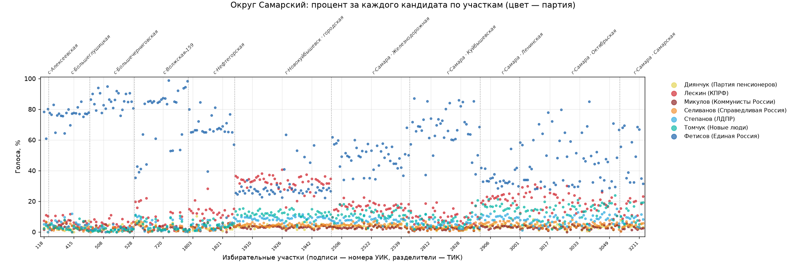

*Округ №159 Самарский: % кандидатов по участкам*

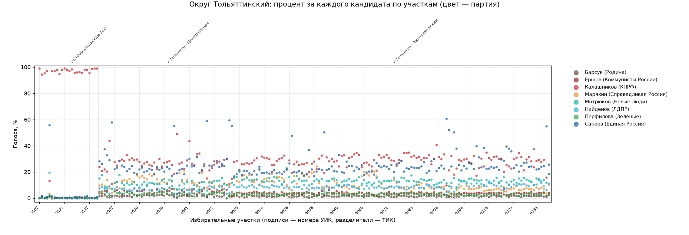

*Округ №160 Тольяттинский*

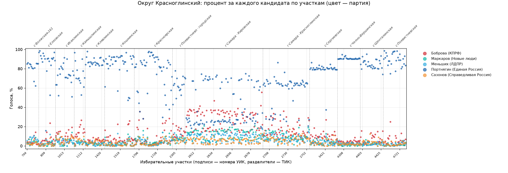

*Округ №161 Красноглинский*

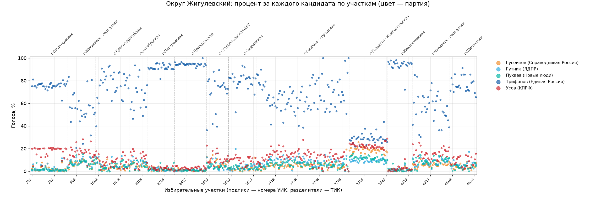

*Округ №162 Жигулёвский*

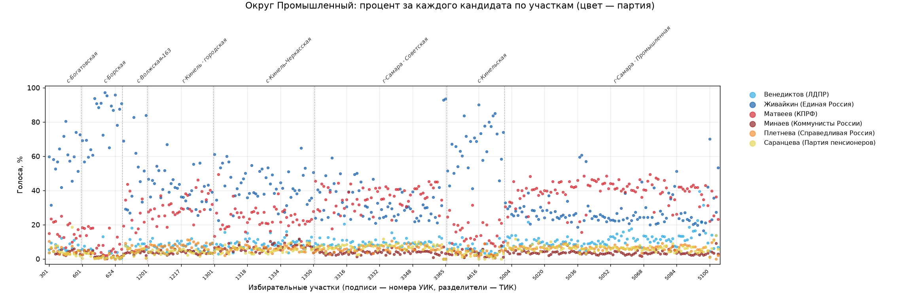

*Округ №163 Промышленный*

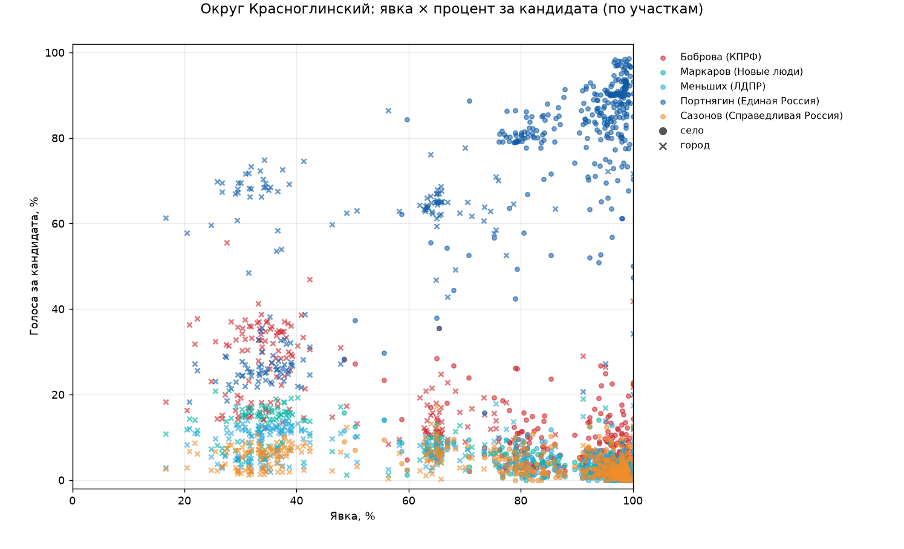

*Округ №161: явка × % за кандидата*

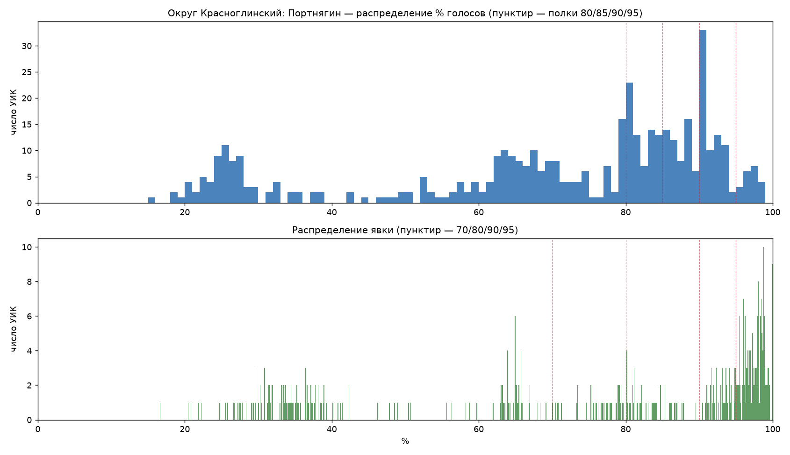

*Округ №161: пик ровно на 90%*

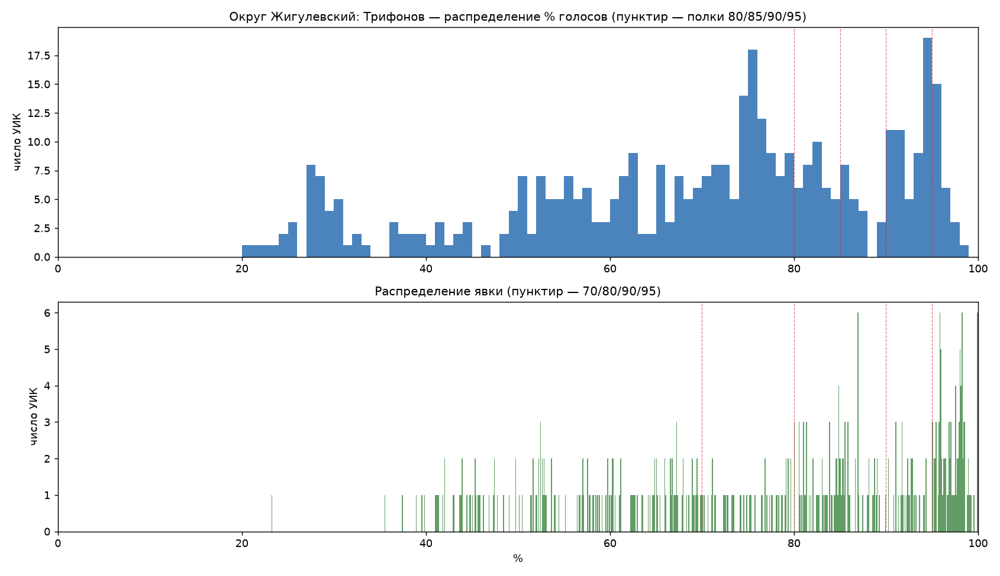

*Округ №162: пик на 95%*

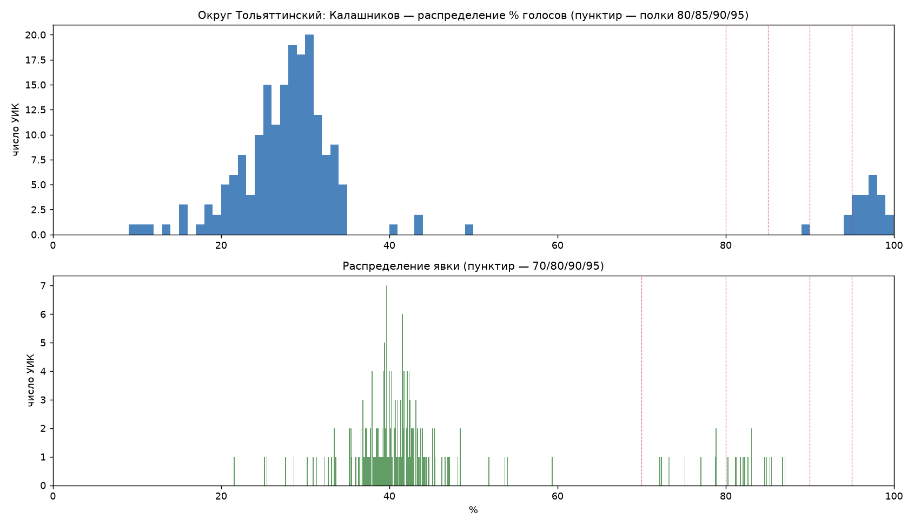

*Округ №160: шип 95–99% (серия Ставропольская-160)*

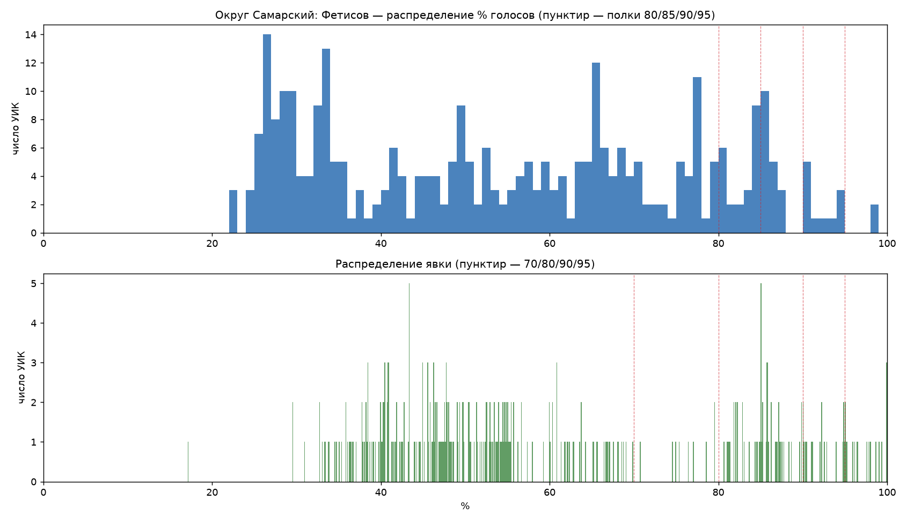

*Округ №159: пик на 85%*

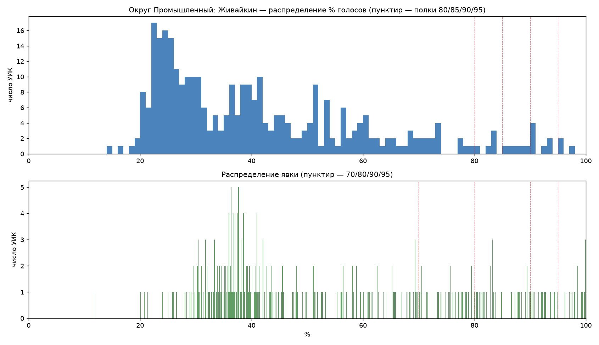

*Округ №163: минимальные аномалии*

### Таблица: УИК с «массовыми нулями/единицами» у кандидатов (≥2 кандидата с ≤2 голосами, явка ≥100)

| УИК | Округ | ТИК | Явившихся | % лидера | Кандидаты с ≤2 голосами |
|---|---|---|---|---|---|
| 127 | №159 Самарский | Алексеевская | 282 | 80,1 | Селиванов (СРЗП) — 0, Степанов (ЛДПР) — 0 |
| 414 | №159 Самарский | Большеглушицкая | 371 | 77,1 | Лескин (КПРФ) — 0, Томчук (Новые люди) — 0 |
| 413 | №159 Самарский | Большеглушицкая | 145 | 69,7 | Степанов (ЛДПР) — 2, Томчук (Новые люди) — 2 |
| 510 | №159 Самарский | Большечерниговская | 608 | 94,9 | Диянчук (Партия пенсионеров) — 2, Микулов (Коммунисты России) — 1, Селиванов (СРЗП) — 1, Степанов (ЛДПР) — 1, Томчук (Новые люди) — 1 |
| 505 | №159 Самарский | Большечерниговская | 500 | 94,0 | Диянчук (Партия пенсионеров) — 1, Микулов (Коммунисты России) — 2, Селиванов (СРЗП) — 2, Томчук (Новые люди) — 2 |
| 509 | №159 Самарский | Большечерниговская | 427 | 80,3 | Лескин (КПРФ) — 0, Степанов (ЛДПР) — 0 |
| 518 | №159 Самарский | Большечерниговская | 245 | 90,6 | Диянчук (Партия пенсионеров) — 2, Селиванов (СРЗП) — 1 |
| 517 | №159 Самарский | Большечерниговская | 198 | 91,9 | Диянчук (Партия пенсионеров) — 0, Микулов (Коммунисты России) — 0, Степанов (ЛДПР) — 0, Томчук (Новые люди) — 0 |
| 526 | №159 Самарский | Большечерниговская | 146 | 90,4 | Диянчук (Партия пенсионеров) — 0, Микулов (Коммунисты России) — 0, Томчук (Новые люди) — 0 |
| 512 | №159 Самарский | Большечерниговская | 125 | 86,4 | Микулов (Коммунисты России) — 0, Селиванов (СРЗП) — 0, Степанов (ЛДПР) — 0, Томчук (Новые люди) — 0 |
| 753 | №159 Самарский | Волжская-159 | 2138 | 98,2 | Лескин (КПРФ) — 2, Селиванов (СРЗП) — 2 |
| 711 | №159 Самарский | Волжская-159 | 601 | 85,0 | Микулов (Коммунисты России) — 0, Селиванов (СРЗП) — 1 |
| 1804 | №159 Самарский | Нефтегорская | 208 | 66,3 | Степанов (ЛДПР) — 2, Томчук (Новые люди) — 2 |
| 1823 | №159 Самарский | Нефтегорская | 127 | 70,9 | Микулов (Коммунисты России) — 0, Селиванов (СРЗП) — 2 |
| 1805 | №159 Самарский | Нефтегорская | 107 | 66,4 | Степанов (ЛДПР) — 2, Томчук (Новые люди) — 1 |
| 3026 | №159 Самарский | Самара, Октябрьская | 673 | 49,0 | Диянчук (Партия пенсионеров) — 2, Микулов (Коммунисты России) — 0 |
| 3537 | №160 Тольяттинский | Ставропольская-160 | 2378 | 95,6 | Барсук (Родина) — 2, Ершов (Коммунисты России) — 2, Перфилова (Зелёные) — 2 |
| 3522 | №160 Тольяттинский | Ставропольская-160 | 2174 | 99,0 | Барсук (Родина) — 2, Ершов (Коммунисты России) — 2, Маряхин (СРЗП) — 2, Мотрюков (Новые люди) — 2, Найденов (ЛДПР) — 2, Перфилова (Зелёные) — 2 |
| 3543 | №160 Тольяттинский | Ставропольская-160 | 2170 | 98,8 | Барсук (Родина) — 2, Перфилова (Зелёные) — 1, Сакеев (ЕР) — 2 |
| 3545 | №160 Тольяттинский | Ставропольская-160 | 2109 | 99,1 | Барсук (Родина) — 1, Ершов (Коммунисты России) — 1, Мотрюков (Новые люди) — 2, Найденов (ЛДПР) — 2, Перфилова (Зелёные) — 2 |
| 3523 | №160 Тольяттинский | Ставропольская-160 | 1950 | 97,9 | Барсук (Родина) — 2, Ершов (Коммунисты России) — 1, Найденов (ЛДПР) — 2 |
| 3525 | №160 Тольяттинский | Ставропольская-160 | 1887 | 98,3 | Ершов (Коммунисты России) — 2, Мотрюков (Новые люди) — 1, Найденов (ЛДПР) — 2, Перфилова (Зелёные) — 2, Сакеев (ЕР) — 1 |
| 3516 | №160 Тольяттинский | Ставропольская-160 | 1566 | 97,0 | Барсук (Родина) — 0, Ершов (Коммунисты России) — 0, Перфилова (Зелёные) — 0 |
| 3533 | №160 Тольяттинский | Ставропольская-160 | 1421 | 97,2 | Барсук (Родина) — 0, Найденов (ЛДПР) — 0, Перфилова (Зелёные) — 0 |
| 3527 | №160 Тольяттинский | Ставропольская-160 | 1303 | 95,9 | Найденов (ЛДПР) — 0, Перфилова (Зелёные) — 1, Сакеев (ЕР) — 0 |
| 3509 | №160 Тольяттинский | Ставропольская-160 | 1260 | 89,2 | Мотрюков (Новые люди) — 2, Найденов (ЛДПР) — 0 |
| 3528 | №160 Тольяттинский | Ставропольская-160 | 1259 | 96,3 | Ершов (Коммунисты России) — 2, Найденов (ЛДПР) — 1 |
| 3546 | №160 Тольяттинский | Ставропольская-160 | 1196 | 99,0 | Барсук (Родина) — 0, Ершов (Коммунисты России) — 0, Мотрюков (Новые люди) — 0, Найденов (ЛДПР) — 0, Перфилова (Зелёные) — 0 |
| 3529 | №160 Тольяттинский | Ставропольская-160 | 1184 | 95,8 | Мотрюков (Новые люди) — 1, Найденов (ЛДПР) — 2, Перфилова (Зелёные) — 2 |
| 3507 | №160 Тольяттинский | Ставропольская-160 | 1120 | 99,0 | Барсук (Родина) — 1, Ершов (Коммунисты России) — 1, Маряхин (СРЗП) — 1, Найденов (ЛДПР) — 1, Перфилова (Зелёные) — 1 |
| 3519 | №160 Тольяттинский | Ставропольская-160 | 1104 | 94,9 | Барсук (Родина) — 1, Ершов (Коммунисты России) — 1, Маряхин (СРЗП) — 2, Мотрюков (Новые люди) — 2, Найденов (ЛДПР) — 1, Перфилова (Зелёные) — 2 |
| 3520 | №160 Тольяттинский | Ставропольская-160 | 938 | 97,9 | Ершов (Коммунисты России) — 2, Маряхин (СРЗП) — 2, Мотрюков (Новые люди) — 2, Найденов (ЛДПР) — 2 |
| 3514 | №160 Тольяттинский | Ставропольская-160 | 895 | 96,9 | Барсук (Родина) — 0, Ершов (Коммунисты России) — 0, Маряхин (СРЗП) — 0, Мотрюков (Новые люди) — 2, Перфилова (Зелёные) — 1 |
| 3517 | №160 Тольяттинский | Ставропольская-160 | 494 | 97,0 | Барсук (Родина) — 0, Ершов (Коммунисты России) — 1, Мотрюков (Новые люди) — 1, Найденов (ЛДПР) — 1, Перфилова (Зелёные) — 0, Сакеев (ЕР) — 2 |
| 3518 | №160 Тольяттинский | Ставропольская-160 | 333 | 97,9 | Барсук (Родина) — 1, Ершов (Коммунисты России) — 1, Маряхин (СРЗП) — 1, Мотрюков (Новые люди) — 1, Найденов (ЛДПР) — 1, Перфилова (Зелёные) — 1, Сакеев (ЕР) — 1 |
| 3508 | №160 Тольяттинский | Ставропольская-160 | 318 | 94,3 | Маряхин (СРЗП) — 1, Мотрюков (Новые люди) — 1, Найденов (ЛДПР) — 2, Перфилова (Зелёные) — 1 |
| 3536 | №160 Тольяттинский | Ставропольская-160 | 282 | 97,9 | Барсук (Родина) — 0, Ершов (Коммунисты России) — 0, Маряхин (СРЗП) — 1, Мотрюков (Новые люди) — 0, Найденов (ЛДПР) — 0, Перфилова (Зелёные) — 0 |
| 803 | №161 Красноглинский | Елховская | 468 | 93,6 | Маркаров (Новые люди) — 0, Сазонов (СРЗП) — 1 |
| 802 | №161 Красноглинский | Елховская | 467 | 98,5 | Маркаров (Новые люди) — 2, Меньших (ЛДПР) — 2, Сазонов (СРЗП) — 0 |
| 817 | №161 Красноглинский | Елховская | 408 | 90,7 | Маркаров (Новые люди) — 0, Сазонов (СРЗП) — 0 |
| 806 | №161 Красноглинский | Елховская | 301 | 96,0 | Меньших (ЛДПР) — 0, Сазонов (СРЗП) — 0 |
| 820 | №161 Красноглинский | Елховская | 288 | 96,9 | Маркаров (Новые люди) — 2, Меньших (ЛДПР) — 2, Сазонов (СРЗП) — 2 |
| 808 | №161 Красноглинский | Елховская | 250 | 90,4 | Меньших (ЛДПР) — 2, Сазонов (СРЗП) — 2 |
| 807 | №161 Красноглинский | Елховская | 235 | 93,2 | Маркаров (Новые люди) — 1, Меньших (ЛДПР) — 2, Сазонов (СРЗП) — 0 |
| 819 | №161 Красноглинский | Елховская | 221 | 91,4 | Меньших (ЛДПР) — 0, Сазонов (СРЗП) — 0 |
| 801 | №161 Красноглинский | Елховская | 197 | 97,0 | Маркаров (Новые люди) — 0, Меньших (ЛДПР) — 1, Сазонов (СРЗП) — 1 |
| 818 | №161 Красноглинский | Елховская | 151 | 90,1 | Меньших (ЛДПР) — 1, Сазонов (СРЗП) — 2 |
| 1017 | №161 Красноглинский | Исаклинская | 234 | 90,2 | Маркаров (Новые люди) — 0, Меньших (ЛДПР) — 0 |
| 1013 | №161 Красноглинский | Исаклинская | 130 | 91,5 | Боброва (КПРФ) — 1, Маркаров (Новые люди) — 1 |
| 1012 | №161 Красноглинский | Исаклинская | 127 | 85,8 | Маркаров (Новые люди) — 0, Сазонов (СРЗП) — 2 |
| 1101 | №161 Красноглинский | Камышлинская | 187 | 96,8 | Маркаров (Новые люди) — 0, Меньших (ЛДПР) — 2, Сазонов (СРЗП) — 0 |
| 1102 | №161 Красноглинский | Камышлинская | 161 | 88,2 | Маркаров (Новые люди) — 1, Меньших (ЛДПР) — 0, Сазонов (СРЗП) — 2 |
| 1418 | №161 Красноглинский | Клявлинская | 203 | 91,1 | Маркаров (Новые люди) — 1, Меньших (ЛДПР) — 1, Сазонов (СРЗП) — 1 |
| 1419 | №161 Красноглинский | Клявлинская | 131 | 91,6 | Маркаров (Новые люди) — 2, Меньших (ЛДПР) — 1, Сазонов (СРЗП) — 1 |
| 1422 | №161 Красноглинский | Клявлинская | 117 | 88,9 | Маркаров (Новые люди) — 1, Меньших (ЛДПР) — 1 |
| 1507 | №161 Красноглинский | Кошкинская | 788 | 83,1 | Меньших (ЛДПР) — 0, Сазонов (СРЗП) — 0 |
| 1526 | №161 Красноглинский | Кошкинская | 445 | 96,6 | Меньших (ЛДПР) — 2, Сазонов (СРЗП) — 2 |
| 1511 | №161 Красноглинский | Кошкинская | 320 | 92,2 | Маркаров (Новые люди) — 1, Меньших (ЛДПР) — 1, Сазонов (СРЗП) — 1 |
| 1512 | №161 Красноглинский | Кошкинская | 306 | 92,2 | Маркаров (Новые люди) — 0, Меньших (ЛДПР) — 0, Сазонов (СРЗП) — 0 |
| 1535 | №161 Красноглинский | Кошкинская | 294 | 92,2 | Маркаров (Новые люди) — 1, Меньших (ЛДПР) — 2, Сазонов (СРЗП) — 1 |
| 1531 | №161 Красноглинский | Кошкинская | 246 | 93,1 | Маркаров (Новые люди) — 1, Сазонов (СРЗП) — 1 |
| 1510 | №161 Красноглинский | Кошкинская | 224 | 84,8 | Боброва (КПРФ) — 0, Меньших (ЛДПР) — 2, Сазонов (СРЗП) — 0 |
| 1519 | №161 Красноглинский | Кошкинская | 202 | 92,1 | Маркаров (Новые люди) — 2, Меньших (ЛДПР) — 2, Сазонов (СРЗП) — 1 |
| 1517 | №161 Красноглинский | Кошкинская | 193 | 91,7 | Маркаров (Новые люди) — 2, Меньших (ЛДПР) — 2, Сазонов (СРЗП) — 2 |
| 1534 | №161 Красноглинский | Кошкинская | 156 | 93,6 | Маркаров (Новые люди) — 0, Меньших (ЛДПР) — 0, Сазонов (СРЗП) — 0 |
| 1514 | №161 Красноглинский | Кошкинская | 142 | 88,0 | Маркаров (Новые люди) — 0, Меньших (ЛДПР) — 1 |
| 1520 | №161 Красноглинский | Кошкинская | 137 | 93,4 | Боброва (КПРФ) — 1, Сазонов (СРЗП) — 1 |
| 1532 | №161 Красноглинский | Кошкинская | 124 | 90,3 | Маркаров (Новые люди) — 0, Меньших (ЛДПР) — 0, Сазонов (СРЗП) — 0 |
| 1521 | №161 Красноглинский | Кошкинская | 120 | 93,3 | Маркаров (Новые люди) — 1, Меньших (ЛДПР) — 1, Сазонов (СРЗП) — 0 |
| 1728 | №161 Красноглинский | Красноярская | 176 | 92,0 | Маркаров (Новые люди) — 2, Меньших (ЛДПР) — 1 |
| 4703 | №161 Красноглинский | Похвистневская | 872 | 91,5 | Маркаров (Новые люди) — 1, Меньших (ЛДПР) — 1 |
| 4718 | №161 Красноглинский | Похвистневская | 648 | 98,3 | Маркаров (Новые люди) — 2, Сазонов (СРЗП) — 2 |
| 4714 | №161 Красноглинский | Похвистневская | 635 | 98,0 | Маркаров (Новые люди) — 1, Меньших (ЛДПР) — 0 |
| 4713 | №161 Красноглинский | Похвистневская | 406 | 97,3 | Меньших (ЛДПР) — 2, Сазонов (СРЗП) — 2 |
| 4704 | №161 Красноглинский | Похвистневская | 403 | 96,5 | Маркаров (Новые люди) — 0, Сазонов (СРЗП) — 2 |
| 4721 | №161 Красноглинский | Похвистневская | 167 | 95,2 | Боброва (КПРФ) — 2, Маркаров (Новые люди) — 1, Меньших (ЛДПР) — 2 |
| 4715 | №161 Красноглинский | Похвистневская | 151 | 98,0 | Боброва (КПРФ) — 1, Маркаров (Новые люди) — 1, Меньших (ЛДПР) — 0, Сазонов (СРЗП) — 1 |
| 4702 | №161 Красноглинский | Похвистневская | 148 | 98,6 | Боброва (КПРФ) — 0, Маркаров (Новые люди) — 0, Меньших (ЛДПР) — 0, Сазонов (СРЗП) — 0 |
| 4322 | №161 Красноглинский | Челно-Вершинская | 559 | 90,2 | Маркаров (Новые люди) — 1, Сазонов (СРЗП) — 1 |
| 4303 | №161 Красноглинский | Челно-Вершинская | 177 | 90,4 | Боброва (КПРФ) — 2, Сазонов (СРЗП) — 2 |
| 4312 | №161 Красноглинский | Челно-Вершинская | 177 | 90,4 | Маркаров (Новые люди) — 0, Сазонов (СРЗП) — 2 |
| 4328 | №161 Красноглинский | Челно-Вершинская | 146 | 90,4 | Меньших (ЛДПР) — 1, Сазонов (СРЗП) — 1 |
| 4313 | №161 Красноглинский | Челно-Вершинская | 102 | 90,2 | Маркаров (Новые люди) — 1, Сазонов (СРЗП) — 2 |
| 4421 | №161 Красноглинский | Шенталинская | 432 | 80,1 | Маркаров (Новые люди) — 0, Сазонов (СРЗП) — 0 |
| 4408 | №161 Красноглинский | Шенталинская | 281 | 95,0 | Маркаров (Новые люди) — 2, Меньших (ЛДПР) — 2 |
| 4412 | №161 Красноглинский | Шенталинская | 202 | 83,2 | Боброва (КПРФ) — 2, Маркаров (Новые люди) — 2 |
| 4403 | №161 Красноглинский | Шенталинская | 164 | 92,7 | Маркаров (Новые люди) — 0, Меньших (ЛДПР) — 2 |
| 4416 | №161 Красноглинский | Шенталинская | 113 | 82,3 | Маркаров (Новые люди) — 2, Меньших (ЛДПР) — 2 |
| 4405 | №161 Красноглинский | Шенталинская | 102 | 88,2 | Маркаров (Новые люди) — 1, Меньших (ЛДПР) — 1 |
| 232 | №162 Жигулевский | Безенчукская | 526 | 77,2 | Гусейнов (СРЗП) — 2, Пухаев (Новые люди) — 2 |
| 230 | №162 Жигулевский | Безенчукская | 495 | 77,0 | Гусейнов (СРЗП) — 0, Пухаев (Новые люди) — 0 |
| 220 | №162 Жигулевский | Безенчукская | 146 | 75,3 | Гусейнов (СРЗП) — 2, Пухаев (Новые люди) — 1 |
| 229 | №162 Жигулевский | Безенчукская | 143 | 80,4 | Гусейнов (СРЗП) — 0, Гутник (ЛДПР) — 1, Пухаев (Новые люди) — 2 |
| 216 | №162 Жигулевский | Безенчукская | 117 | 74,4 | Гутник (ЛДПР) — 2, Пухаев (Новые люди) — 0 |
| 1606 | №162 Жигулевский | Красноармейская | 235 | 90,6 | Гусейнов (СРЗП) — 2, Пухаев (Новые люди) — 0 |
| 1612 | №162 Жигулевский | Красноармейская | 130 | 92,3 | Гутник (ЛДПР) — 2, Пухаев (Новые люди) — 1 |
| 2224 | №162 Жигулевский | Пестравская | 361 | 90,0 | Гутник (ЛДПР) — 0, Усов (КПРФ) — 0 |
| 2209 | №162 Жигулевский | Пестравская | 246 | 95,5 | Гусейнов (СРЗП) — 0, Пухаев (Новые люди) — 0 |
| 2210 | №162 Жигулевский | Пестравская | 114 | 90,4 | Пухаев (Новые люди) — 0, Усов (КПРФ) — 2 |
| 2420 | №162 Жигулевский | Приволжская | 570 | 91,1 | Гусейнов (СРЗП) — 2, Пухаев (Новые люди) — 2 |
| 2422 | №162 Жигулевский | Приволжская | 457 | 95,2 | Гусейнов (СРЗП) — 1, Гутник (ЛДПР) — 0, Пухаев (Новые люди) — 1 |
| 2427 | №162 Жигулевский | Приволжская | 451 | 92,7 | Гутник (ЛДПР) — 2, Пухаев (Новые люди) — 1 |
| 2417 | №162 Жигулевский | Приволжская | 249 | 95,2 | Гусейнов (СРЗП) — 0, Гутник (ЛДПР) — 2 |
| 2424 | №162 Жигулевский | Приволжская | 205 | 94,1 | Пухаев (Новые люди) — 2, Усов (КПРФ) — 2 |
| 2405 | №162 Жигулевский | Приволжская | 136 | 94,9 | Гусейнов (СРЗП) — 2, Гутник (ЛДПР) — 2, Пухаев (Новые люди) — 1, Усов (КПРФ) — 2 |
| 2425 | №162 Жигулевский | Приволжская | 116 | 94,8 | Гусейнов (СРЗП) — 2, Гутник (ЛДПР) — 1, Пухаев (Новые люди) — 1, Усов (КПРФ) — 2 |
| 2407 | №162 Жигулевский | Приволжская | 115 | 96,5 | Гусейнов (СРЗП) — 1, Гутник (ЛДПР) — 0, Пухаев (Новые люди) — 0 |
| 2406 | №162 Жигулевский | Приволжская | 112 | 94,6 | Гусейнов (СРЗП) — 1, Гутник (ЛДПР) — 1, Пухаев (Новые люди) — 2, Усов (КПРФ) — 2 |
| 2401 | №162 Жигулевский | Приволжская | 106 | 96,2 | Гусейнов (СРЗП) — 1, Гутник (ЛДПР) — 1, Пухаев (Новые люди) — 1, Усов (КПРФ) — 1 |
| 2426 | №162 Жигулевский | Приволжская | 101 | 100,0 | Гусейнов (СРЗП) — 0, Гутник (ЛДПР) — 0, Пухаев (Новые люди) — 0, Усов (КПРФ) — 0 |
| 3605 | №162 Жигулевский | Сызранская | 210 | 86,2 | Гусейнов (СРЗП) — 1, Гутник (ЛДПР) — 0 |
| 3616 | №162 Жигулевский | Сызранская | 148 | 93,2 | Гусейнов (СРЗП) — 0, Пухаев (Новые люди) — 0 |
| 3781 | №162 Жигулевский | Сызранская городская | 396 | 97,7 | Гусейнов (СРЗП) — 1, Гутник (ЛДПР) — 1 |
| 4107 | №162 Жигулевский | Хворостянская | 426 | 95,1 | Гусейнов (СРЗП) — 1, Пухаев (Новые люди) — 1 |
| 4101 | №162 Жигулевский | Хворостянская | 425 | 96,7 | Гутник (ЛДПР) — 0, Усов (КПРФ) — 0 |
| 4114 | №162 Жигулевский | Хворостянская | 351 | 95,2 | Гутник (ЛДПР) — 0, Пухаев (Новые люди) — 0 |
| 4109 | №162 Жигулевский | Хворостянская | 283 | 95,4 | Гусейнов (СРЗП) — 1, Пухаев (Новые люди) — 1 |
| 4103 | №162 Жигулевский | Хворостянская | 230 | 97,8 | Гусейнов (СРЗП) — 0, Гутник (ЛДПР) — 1, Усов (КПРФ) — 0 |
| 4108 | №162 Жигулевский | Хворостянская | 209 | 98,1 | Гусейнов (СРЗП) — 1, Гутник (ЛДПР) — 2, Пухаев (Новые люди) — 0, Усов (КПРФ) — 1 |
| 4119 | №162 Жигулевский | Хворостянская | 180 | 96,1 | Гутник (ЛДПР) — 1, Пухаев (Новые люди) — 2, Усов (КПРФ) — 1 |
| 4105 | №162 Жигулевский | Хворостянская | 148 | 91,2 | Гутник (ЛДПР) — 0, Усов (КПРФ) — 0 |
| 4113 | №162 Жигулевский | Хворостянская | 136 | 95,6 | Гусейнов (СРЗП) — 0, Гутник (ЛДПР) — 2, Пухаев (Новые люди) — 0 |
| 4115 | №162 Жигулевский | Хворостянская | 102 | 97,1 | Гусейнов (СРЗП) — 0, Гутник (ЛДПР) — 0, Пухаев (Новые люди) — 0 |
| 617 | №163 Промышленный | Борская | 801 | 97,3 | Минаев (Коммунисты России) — 2, Плетнева (СРЗП) — 0, Саранцева (Партия пенсионеров) — 1 |
| 608 | №163 Промышленный | Борская | 586 | 93,7 | Плетнева (СРЗП) — 2, Саранцева (Партия пенсионеров) — 1 |
| 624 | №163 Промышленный | Борская | 555 | 95,9 | Венедиктов (ЛДПР) — 0, Минаев (Коммунисты России) — 0, Плетнева (СРЗП) — 0, Саранцева (Партия пенсионеров) — 0 |
| 630 | №163 Промышленный | Борская | 359 | 87,5 | Минаев (Коммунисты России) — 1, Саранцева (Партия пенсионеров) — 1 |
| 611 | №163 Промышленный | Борская | 279 | 90,7 | Венедиктов (ЛДПР) — 2, Плетнева (СРЗП) — 1, Саранцева (Партия пенсионеров) — 1 |
| 632 | №163 Промышленный | Борская | 268 | 90,7 | Венедиктов (ЛДПР) — 1, Плетнева (СРЗП) — 2 |
| 4609 | №163 Промышленный | Кинельская | 220 | 83,6 | Венедиктов (ЛДПР) — 2, Минаев (Коммунисты России) — 2 |

При явке в сотни человек и честном распределении значения 0–2 у кандидата парламентских партий практически невозможны (ожидание — десятки голосов). В большинство этих УИК лидер получил 70–99%.

### Файлы

- **interactive.html** — интерактивные графики: наведение на точку показывает УИК/ТИК/явку/процент, красной обводкой отмечены аномальные УИК. Локальный файл, открывается в любом браузере (нужен интернет для загрузки plotly). Для публичной ссылки загрузите на GitHub Pages или Netlify Drop.
- **suspicious_uiks.csv** — реестр 471 подозрительного УИК с перечнем сработавших тестов.
- **uik_results.csv** — все 1703 УИК с исходными числами.
- **raw/** — сырые JSON-протоколы ГАС «Выборы» (первоисточник для проверки).

*Отчёт подготовлен автоматическим статистическим анализом. Вероятностные выводы не являются обвинительными. Данные предварительные — при публикации окончательных протоколов отчёт перегенерируется.*